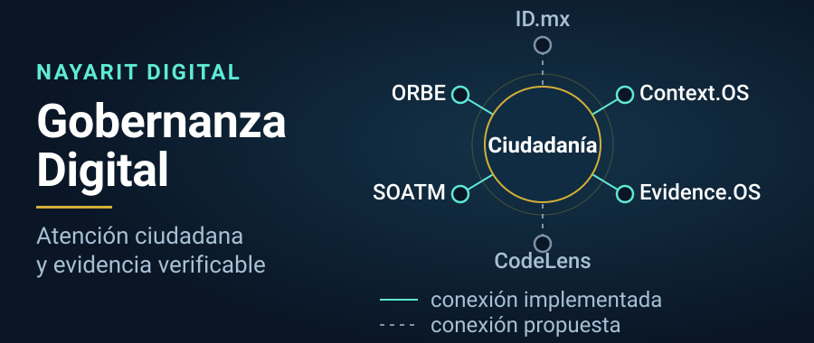

<p align="center">
  
</p>

# Gobernanza Digital

**Inteligencia artificial aplicada a la atención ciudadana, la interoperabilidad y la evidencia verificable.**

Desarrollamos una capa de orientación y coordinación para ayudar a las personas a
expresar lo que necesitan, identificar el servicio correspondiente y conservar
trazabilidad del recorrido. Su integración con las instituciones se construye y
verifica por etapas.

Hoy esa capa funciona en **modo laboratorio**: el recorrido completo —desde que una
persona describe un problema hasta que se emite un registro de evidencia— se ejecuta
y se prueba, pero **ninguna de sus respuestas produce un efecto administrativo real**.

> **Posicionamiento.** Este ecosistema **complementa** la infraestructura oficial del
> Estado mexicano —el portal **gob.mx**, **Llave MX** (la identidad digital nacional) y
> los sistemas municipales existentes—. **No la sustituye y no crea una identidad
> paralela.** Es un prototipo desarrollado por el equipo ConnectX y presentado para
> evaluación técnica e institucional; **no es un sistema oficial** del Gobierno de
> Nayarit ni del Ayuntamiento de Tepic.

---

### Navegación

[Arquitectura](#arquitectura) · [Demostración](#demostración) · [Evidencias](#evidencias) · [Estado del proyecto](#estado-del-proyecto) · [Colaboración](#colaboración) · [Glosario](#glosario)

---

## Arquitectura

La ciudadanía está al centro. Cada componente resuelve una parte del recorrido y se
conecta con las personas, no entre bases de datos.

**Cómo leer la columna «Conexión»:**

- **Implementada** — existe código en este repositorio y pruebas que lo ejercitan.
  Corresponde a las líneas continuas del banner.
- **Propuesta** — está documentada y diseñada, pero **no existe código** que la ejecute.
  Corresponde a las líneas punteadas del banner.

| Componente | Responsabilidad | Conexión |
|---|---|---|
| **ORBE** — asistente conversacional que orienta a la persona | Escucha lo que dice la persona y decide si eso es una pregunta (solo se responde), una frase ambigua (se pide aclaración) o una solicitud real (se convierte en una petición formal). Es la frontera que impide que una conversación se vuelva un trámite por accidente. | **Implementada** — [`src/orbe/`](./src/orbe/) |
| **Context.OS** — plano de control que autoriza o rechaza | Recibe la petición formal, verifica jurisdicción, propósito y datos mínimos contra una política escrita, pide consentimiento cuando hay datos personales, y solo entonces ejecuta. La decisión es determinística: **ningún modelo de lenguaje decide políticas.** | **Implementada** — [`contextos/`](./contextos/README.md) |
| **Evidence.OS** — registro de lo ocurrido | Por cada decisión genera un registro con identificador, momento, política aplicada y una huella digital SHA-256 (una especie de sello que permite detectar si el registro fue alterado después). Hoy su estado es `CHECKSUM_ONLY`: **detecta alteraciones, pero no es una firma institucional.** | **Implementada** — dentro de [`contextos/`](./contextos/README.md) |
| **SOATM / Nayarit Digital** — la aplicación municipal | Sistema Operativo de Administración Territorial: la aplicación web con el panel de gobierno (C5) y la aplicación ciudadana. Reúne 29 módulos de trámites y servicios municipales, en distintos grados de avance. | **Implementada** — [`src/`](./src/), inventario en [`INDICE.json`](./docs/marco/modulos/INDICE.json) |
| **ID.mx** — capa de identidad | Nombre de arquitectura para la futura capa de identidad ciudadana, pensada para apoyarse en Llave MX. **No existe como código**; hoy la identidad real del prototipo es un inicio de sesión con Google. | **Propuesta** — [auditoría](./docs/auditoria-orbe/AUDITORIA_CONTEXTOS_IDMX.md) |
| **CodeLens** — revisión asistida de código | **No existe registro de este componente en el repositorio.** Se menciona aquí para no omitirlo del ecosistema, pero no hay código, documento ni prueba que lo respalde. | **Propuesta sin registro** |

### Accesos del ecosistema

- [**Orbe Central — mapa modular del ecosistema**](./docs/orbe/README.md) — Índice de los 9 módulos conceptuales del Orbe, con registro [`modulos.json`](./docs/orbe/modulos.json) legible por máquina y tres herramientas visuales en HTML.
- [**Pulso Nayarit**](./pulso-nayarit/README.md) — Ejercicio ciudadano de opinión con libro mayor auditable (un registro encadenado que cualquiera puede descargar y recalcular). Su base de datos es PostgreSQL sobre Supabase. Ver [limitaciones](#estado-del-proyecto).
- [**Soberanía Digital Infantil (SINISI)**](./docs/marco/soberania-digital-infantil/README.md) — Propuesta federal de identidad digital para niñas, niños y adolescentes, con verificación de edad de doble anonimato, ficha legislativa y diagramas de flujo.

---

## Demostración

Lo que sigue son recorridos **que fueron ejecutados** en este repositorio, sobre el
commit indicado al final de la sección [Estado del proyecto](#estado-del-proyecto).
Cada uno indica qué resuelve, cómo reproducirlo, qué debe salir y qué **no** prueba.

Preparación común (una sola vez):

```bash
nvm use        # Node 22
npm ci
```

### 1. Un reporte ciudadano recorre el sistema completo

**Qué resuelve.** Una persona reporta un bache. El sistema decide que eso sí es una
solicitud, la valida contra una política escrita, la ejecuta en modo laboratorio y
emite un registro de evidencia con huella digital.

**Cómo probarlo.** En una terminal, levante el laboratorio:

```bash
CONTEXTOS_HOST=127.0.0.1 CONTEXTOS_PORT=3011 \
CONTEXTOS_ALLOWED_ORIGINS=http://localhost:3000 \
npm run contextos:lab
```

En otra terminal, confirme que está vivo y envíe el reporte:

```bash
curl -s http://127.0.0.1:3011/api/contextos/v0.1/health

curl -s -X POST http://127.0.0.1:3011/api/contextos/v0.1/execute \
  -H 'content-type: application/json' \
  -d '{"intent":{
        "schemaVersion":"contextos.v0.1",
        "requestId":"demo-0001",
        "occurredAt":"2026-09-16T07:00:00.000Z",
        "channel":"orbe",
        "actor":{"type":"citizen","authenticated":false},
        "jurisdiction":{"country":"MX","state":"NAY","municipality":"TEPIC"},
        "intent":{"name":"report_public_infrastructure_issue","subject":"bache",
                  "semanticContractId":"mx.nay.tepic.public-works.report.semantic",
                  "semanticContractVersion":"0.1.0",
                  "semanticRegistryVersion":"orbe.semantic-registry.v0.1"},
        "purpose":"report_public_infrastructure_issue",
        "data":{"description":"Bache en avenida Mexico 120",
                "location":{"address":"Avenida Mexico 120, Tepic"}}}}'
```

**Resultado esperado.** El primer comando responde
`{"service":"context-os-runtime","version":"0.1.0","executionMode":"LAB_MOCK","authority":"NONE"}`.
El segundo responde `"status":"EXECUTED"` con `"decision":"ALLOW"`, un folio de
laboratorio con el prefijo `LAB-PW-`, un `evidenceId`, una huella `sha256` de 64
caracteres e `"integrityAssurance":"CHECKSUM_ONLY"`. El mensaje que devuelve el
adaptador dice textualmente: *«Reporte aceptado en laboratorio. No constituye una
orden de trabajo municipal.»*

Si repite el mismo comando sin cambiar `requestId`, el sistema devuelve **el mismo
folio y el mismo `evidenceId`**: no crea un segundo reporte. Eso es la idempotencia,
y se comprobó en esta corrida.

La política rechaza antes de ejecutar cuando algo no cuadra. Para probarlo hay que
cambiar **dos** cosas: el campo en cuestión **y** el `requestId` (si se repite el mismo
identificador, el sistema responde `IDEMPOTENCY_CONFLICT`, que es la idempotencia
haciendo su trabajo). Con un `requestId` nuevo:

- cambiar `"municipality":"TEPIC"` por otro municipio devuelve `DENIED` con el motivo
  `JURISDICTION_NOT_ALLOWED`;
- cambiar el `purpose` devuelve `DENIED` con el motivo `PURPOSE_NOT_ALLOWED`.

En ambos casos **igual se emite evidencia** (de tipo `POLICY_ONLY`), porque también se
registra lo que se negó.

**Evidencia disponible.** [`contextos/README.md`](./contextos/README.md) (alcance exacto
y lo que el runtime **no** hace), [`docs/orbe/DESPLIEGUE_LAB.md`](./docs/orbe/DESPLIEGUE_LAB.md).

**Limitaciones.** El modo de ejecución es `LAB_MOCK`: **no se crea ninguna orden de
trabajo municipal y ninguna autoridad recibe nada.** La huella SHA-256 detecta
alteraciones del registro, pero no es firma electrónica, sello de tiempo ni prueba de
inmutabilidad frente a un atacante. La idempotencia vive en la memoria del proceso: si
el servidor se reinicia, se pierde. Solo existe **un** trámite modelado (bache o
luminaria en Tepic).

### 2. Las reglas de la frontera semántica están probadas

**Qué resuelve.** Comprueba que el sistema no ejecute lo que no debe: que una pregunta
informativa nunca dispare un trámite, que el consentimiento sea obligatorio antes de
compartir un contacto personal, y que una evidencia manipulada sea detectada.

**Cómo probarlo.**

```bash
npm run test:orbe-contextos
```

**Resultado esperado.** `Test Files 3 passed (3)` y `Tests 45 passed (45)`.

**Evidencia disponible.** Los tres archivos que se ejecutan:
[`contextos/__tests__/runtime.test.ts`](./contextos/__tests__/runtime.test.ts),
[`src/orbe/__tests__/contextosBridge.test.ts`](./src/orbe/__tests__/contextosBridge.test.ts) y
[`shared/semantic/__tests__/registry.test.ts`](./shared/semantic/__tests__/registry.test.ts).

**Limitaciones.** Son pruebas automatizadas de código, no una prueba con navegador ni
con personas reales. No demuestran que la interfaz ciudadana se comporte bien en
pantalla.

### 3. La Guardia impide regresiones conocidas

**Qué resuelve.** Ocho revisiones automáticas que bloquean errores que ya ocurrieron en
este proyecto: que una llave de API llegue al navegador (pasó cuatro veces), que se
borren archivos de despliegue, o que se publiquen documentos internos.

**Cómo probarlo.**

```bash
node scripts/verificar-regresiones.mjs
```

**Resultado esperado.** `✔ Guardia de regresiones: todo en orden.`

**Evidencia disponible.** [`scripts/verificar-regresiones.mjs`](./scripts/verificar-regresiones.mjs),
[`docs/marco/PROTOCOLO_SEGURIDAD.md`](./docs/marco/PROTOCOLO_SEGURIDAD.md) y el flujo de
integración continua [`guardia-regresiones.yml`](./.github/workflows/guardia-regresiones.yml).

**Limitaciones.** La Guardia revisa reglas de seguridad y de despliegue. **No** valida
que la aplicación funcione ni que los datos sean correctos.

### Lo que todavía no se puede demostrar

- **La suite de extremo a extremo no pasa completa.** `npm run test:orbe-p0-e2e`
  devuelve **7 de 8 casos** sobre el commit revisado. El caso 8 («Runtime caído»)
  falla. La corrección está propuesta y aún **no incorporada**; ver
  [Estado del proyecto](#estado-del-proyecto).
- **No hay demostración reproducible en navegador.** El recorrido se prueba por
  HTTP y por código, no abriendo la aplicación. La propia auditoría lo señala en
  [`ORBE_BRECHAS.md`](./docs/orbe/canon/v0.1/ORBE_BRECHAS.md) (punto P0.2).
- **La aplicación no compila en una copia recién clonada.** `src/firebase.ts` importa
  `firebase-applet-config.json`, un archivo deliberadamente excluido del repositorio
  porque contiene una llave real. Sin él, `npm run lint` falla con
  `TS2307: Cannot find module '../firebase-applet-config.json'`. Es el comportamiento
  esperado y está documentado en [`CLAUDE.md`](./CLAUDE.md); se resuelve copiando
  `firebase-applet-config.example.json` y llenándolo.
- **No hay demostración pública en línea verificable desde el repositorio.** Existe
  documentación de cómo desplegar el laboratorio, pero el repositorio no prueba que
  haya un despliegue activo.

---

## Evidencias

Documentos que sostienen lo afirmado arriba. Están en el repositorio y pueden leerse
sin ejecutar nada.

| Documento | Qué contiene |
|---|---|
| [`contextos/README.md`](./contextos/README.md) | Alcance del plano de control y, sobre todo, **lo que no hace** |
| [`docs/orbe/P0_ACCEPTANCE.md`](./docs/orbe/P0_ACCEPTANCE.md) | Los cinco criterios que deben cumplirse para declarar cerrada la etapa P0 |
| [`docs/orbe/P0_SCOPE.md`](./docs/orbe/P0_SCOPE.md) | Alcance congelado de la etapa: qué entra y qué queda excluido |
| [`docs/orbe/ORBE_P0_REPORTE.md`](./docs/orbe/ORBE_P0_REPORTE.md) | Separa explícitamente lo construido de lo pendiente de verificar |
| [`docs/orbe/canon/v0.1/ORBE_BRECHAS.md`](./docs/orbe/canon/v0.1/ORBE_BRECHAS.md) | Brechas técnicas ordenadas por prioridad (P0 a P3) |
| [`docs/orbe/AURA_VS_ORBE.md`](./docs/orbe/AURA_VS_ORBE.md) | Qué puede y qué no puede hacer el asistente conversacional |
| [`docs/auditoria-orbe/ESTADO_MADUREZ_TECNOLOGICA.md`](./docs/auditoria-orbe/ESTADO_MADUREZ_TECNOLOGICA.md) | Madurez por capa (instantánea del 14 de agosto de 2026) |
| [`docs/auditoria-orbe/AUDITORIA_CONTEXTOS_IDMX.md`](./docs/auditoria-orbe/AUDITORIA_CONTEXTOS_IDMX.md) | Qué código respalda realmente los nombres Context.OS e ID.mx |
| [`docs/auditoria-orbe/CIERRE_AUDITORIA_FINAL.md`](./docs/auditoria-orbe/CIERRE_AUDITORIA_FINAL.md) | Afirmaciones exageradas detectadas y corregidas, una por una |
| [`docs/AUDITORIA_CODIGO_AGOSTO_2026.md`](./docs/AUDITORIA_CODIGO_AGOSTO_2026.md) | Deuda técnica conocida del código |
| [`docs/marco/BIBLIOTECA_LEGAL.md`](./docs/marco/BIBLIOTECA_LEGAL.md) | Base normativa por módulo, cada cita con estatus VERIFICADO o POR VERIFICAR |
| [`docs/marco/GLOSARIO_OFICIAL.md`](./docs/marco/GLOSARIO_OFICIAL.md) | Vocabulario obligatorio y regla de etiquetado de cifras |
| [`docs/marco/PROTOCOLO_SEGURIDAD.md`](./docs/marco/PROTOCOLO_SEGURIDAD.md) | Manejo de llaves, incidentes ocurridos y reglas de la Guardia |
| [`docs/plataforma/05-MANUAL-DESARROLLADORES.md`](./docs/plataforma/05-MANUAL-DESARROLLADORES.md) | Qué interfaces de programación existen hoy |

---

## Estado del proyecto

**Sobre la escala de madurez.** Este repositorio **no** define la escala
`PROPOSED / EXPERIMENTAL / VALIDATED / PILOT / PRODUCTION / INSTITUTIONAL`. La escala
vigente es la de [`docs/orbe/modulos.json`](./docs/orbe/modulos.json), declarada oficial
en el [glosario](./docs/marco/GLOSARIO_OFICIAL.md#3-estados-de-módulo-fuente-docsorbemodulosjson):
**Propuesta · Diseñado · En construcción · Piloto · Desplegado · Producción**. Es la que
se usa en la tabla. Existe un segundo inventario,
[`docs/marco/modulos/INDICE.json`](./docs/marco/modulos/INDICE.json), que mide una cosa
distinta —completitud del código— con su propio vocabulario (`real`, `parcial`,
`maqueta`, `riesgo`); no se mezclan.

**Sobre el modo de ejecución.** `LAB_MOCK` significa **simulación de laboratorio**: el
sistema responde, registra y entrega un folio, pero no produce ningún efecto fuera de
sí mismo. No equivale a un servicio operativo. Los otros dos modos previstos,
`SANDBOX` e `INSTITUTIONAL`, están explícitamente fuera del alcance actual.

| Componente | Capacidad | Madurez | Modo de ejecución | Integración institucional | Evidencia | Próximo paso |
|---|---|---|---|---|---|---|
| **ORBE** (frontera semántica) | Clasifica lo que dice la persona; impide que preguntas y frases ambiguas se vuelvan trámites | En construcción | No aplica (decide, no ejecuta) | Ninguna | 45/45 pruebas en verde | Cubrir un segundo trámite de bajo riesgo |
| **Context.OS Runtime** v0.1 | Política determinística, consentimiento, catálogo de servicios, idempotencia | En construcción | `LAB_MOCK` | Ninguna | Recorrido 1 ejecutado; 45/45 pruebas | Pasar a `SANDBOX` con un sistema real de prueba |
| **Evidence.OS** (registro de evidencia) | Registro con identificador, política aplicada y huella SHA-256 | En construcción | `CHECKSUM_ONLY` | Ninguna | Respuesta del recorrido 1 | Almacenamiento que solo permita añadir, y anclaje temporal |
| **Suite de extremo a extremo** | Ocho casos del recorrido bache/luminaria por HTTP real | En construcción | `LAB_MOCK` | Ninguna | **7 de 8 casos** sobre el commit revisado | Incorporar la corrección del caso 8 (PR #63) |
| **SOATM / Nayarit Digital** (aplicación) | 29 módulos: 8 con servicio real, 4 parciales, 15 maquetas, 2 en riesgo | En construcción | Demostración con datos simulados etiquetados | Ninguna | [`INDICE.json`](./docs/marco/modulos/INDICE.json), verificado contra el código | Reducir el número de maquetas etiquetándolas o completándolas |
| **Pulso Nayarit** | Libro mayor encadenado con reglas de unicidad e inmutabilidad escritas en la base de datos | Desplegado (según el registro del repositorio) | Consulta de demostración con datos de prueba | Ninguna | Migraciones SQL y panel configurado, en [`pulso-nayarit/`](./pulso-nayarit/README.md) | Verificar el despliegue desde fuera del repositorio y revisar el marco del INE |
| **ID.mx** (identidad) | Capa de identidad ciudadana | Propuesta | No existe | Ninguna | [Auditoría](./docs/auditoria-orbe/AUDITORIA_CONTEXTOS_IDMX.md): «no existe como código» | Convenio y proveedor de identidad antes de escribir código |
| **CodeLens** | Revisión asistida de código | Sin registro en el repositorio | No existe | Ninguna | Ninguna | Documentar su alcance o retirarlo del ecosistema |
| **SINISI** (soberanía digital infantil) | Identidad digital para menores con verificación de doble anonimato | Propuesta | No existe | Ninguna | [Ficha legislativa](./docs/marco/soberania-digital-infantil/README.md) | Ruta legislativa |

**Notas que un evaluador debe conocer antes de sacar conclusiones:**

1. **Ninguna casilla de «Integración institucional» dice otra cosa que “ninguna”.** No
   hay conexión productiva con RENAPO, el SAT, catastro, SIAPA, Llave MX ni ningún otro
   sistema de gobierno. No hay convenios firmados.
2. **Pulso Nayarit no es una encuesta electoral oficial.** Es un ejercicio ciudadano de
   opinión, sin afiliación partidista, con datos de prueba. **Publicar preferencias
   electorales requiere una revisión frente a las reglas del INE (Instituto Nacional
   Electoral) antes de destacarlo**; esa revisión no se ha hecho.
3. **El despliegue de Pulso Nayarit no pudo comprobarse desde el repositorio.** Lo que
   sí consta: las migraciones SQL completas y un panel configurado contra un proyecto de
   base de datos. La verificación de la cadena que reporta el módulo se ejecutó fuera de
   este repositorio y no puede repetirse desde aquí.
4. **Los registros de decisión de arquitectura (ADR) no existen.** No hay ningún archivo
   ADR en el repositorio. Queda como pendiente de registro; este README no enlaza
   documentos inexistentes.
5. **`docs/auditoria-orbe/ESTADO_MADUREZ_TECNOLOGICA.md` está desactualizado** en un
   punto: fechado el 14 de agosto de 2026, afirma que Context.OS «no existe como
   código». Desde entonces se incorporó [`contextos/`](./contextos/README.md). El
   documento se conserva como registro histórico, según la regla del proyecto de
   corregir con documentos posteriores en lugar de borrar.

*Revisado sobre el commit `d5a78aa` el 16 de septiembre de 2026.*

---

## Colaboración

Este repositorio no tiene todavía un archivo `CONTRIBUTING.md` ni una licencia
publicada. Mientras tanto, estas son las reglas vigentes, tomadas de
[`docs/marco/GOBERNANZA_REPOSITORIO.md`](./docs/marco/GOBERNANZA_REPOSITORIO.md) y de
[`CLAUDE.md`](./CLAUDE.md):

- **Todo cambio entra por rama y propuesta de cambio (pull request) hacia `main`.**
  Nunca se sube directo a `main`.
- **Nombres de rama:** `feat/<módulo>`, `fix/<ámbito>`, `docs/<tema>`, `chore/<tarea>`.
  Sin nombres de personas.
- **Mensajes de commit en español**, con prefijo de tipo: `fix(oficios): …`,
  `docs(marco): …`, `feat(salud): …`.
- **Antes de entregar**, los tres comandos en verde:
  `node scripts/verificar-regresiones.mjs`, `npm run lint` y `npx vite build`. Si tocó
  `contextos/`, `shared/semantic/` o `src/orbe/`, añada `npm run test:orbe-contextos`.
- **Archivos protegidos.** Cambiar `index.html`, `vite.config.ts`, `netlify.toml`,
  `public/robots.txt`, `src/App.tsx`, `server.ts`, `docs/`,
  `scripts/verificar-regresiones.mjs` o `.github/workflows/` exige mención explícita en
  la descripción de la propuesta de cambio.
- **Regla de honestidad de datos.** Ninguna cifra simulada sin etiqueta (`SIMULADO`,
  `PROYECCIÓN`, `META`, `DEMO`). Las citas legales solo se toman de la
  [Biblioteca Legal](./docs/marco/BIBLIOTECA_LEGAL.md) y solo si están en estatus
  VERIFICADO.
- **Ningún dato personal real** en el repositorio, ni en datos de demostración.
- **Ninguna llave de API** en el código del navegador. La Guardia falla el build si
  detecta una.

Las revisiones más útiles hoy son las auditorías al esquema del libro mayor de Pulso
Nayarit y a las reglas de política de Context.OS.

**Pendiente de definir:** la licencia. La estrategia del proyecto recomienda AGPL-3.0
(ver [`ESTRATEGIA_ESTANDAR_ABIERTO.md`](./docs/marco/ESTRATEGIA_ESTANDAR_ABIERTO.md)),
pero **no hay archivo de licencia en el repositorio**, de modo que las condiciones de
reutilización todavía no están formalmente establecidas.

---

## Glosario

| Sigla o término | Significado |
|---|---|
| **ORBE** | Asistente conversacional que orienta al ciudadano y decide si lo que dice debe convertirse en una solicitud formal. |
| **Context.OS** | Plano de control institucional: recibe la solicitud, la evalúa contra una política escrita y autoriza o rechaza. |
| **Evidence.OS** | Componente que registra cada decisión con una huella digital que permite detectar alteraciones. |
| **SOATM** | Sistema Operativo de Administración Territorial: la aplicación municipal de este repositorio. |
| **LNETB** | Ley Nacional para Eliminar Trámites Burocráticos (publicada el 16 de julio de 2025). Obliga a los tres órdenes de gobierno a simplificar y digitalizar trámites. |
| **ATDT** | Agencia de Transformación Digital y Telecomunicaciones: la autoridad federal que coordina el Modelo Nacional de digitalización. |
| **INE** | Instituto Nacional Electoral: la autoridad electoral federal de México. |
| **Llave MX** | Identidad digital nacional del Gobierno de México, prevista en la LNETB. Este proyecto **no** está integrado con ella. |
| **LAB_MOCK** | Modo de ejecución de laboratorio: el sistema responde y registra, pero **no produce ningún efecto administrativo real**. |
| **CHECKSUM_ONLY** | Nivel de garantía de la evidencia: solo huella digital. Permite **detectar** si un registro fue alterado; **no** es firma electrónica ni sello de tiempo. |
| **SHA-256** | Algoritmo que convierte un texto en una huella de 64 caracteres. Si el texto cambia, la huella cambia: por eso sirve para detectar alteraciones. |
| **ADR** | Registro de decisión de arquitectura (*Architecture Decision Record*): documento breve que explica por qué se tomó una decisión técnica. **No existen en este repositorio.** |
| **SINISI** | Sistema Nacional de Identidad Soberana Infantil: propuesta de identidad digital para menores de edad. |
| **Guardia de regresiones** | Script que bloquea la entrega si detecta errores que ya ocurrieron antes (llaves expuestas, archivos de despliegue borrados). |
| **C5** | Panel de mando de gobierno dentro de la aplicación (la vista para funcionarios, distinta de la vista ciudadana). |
