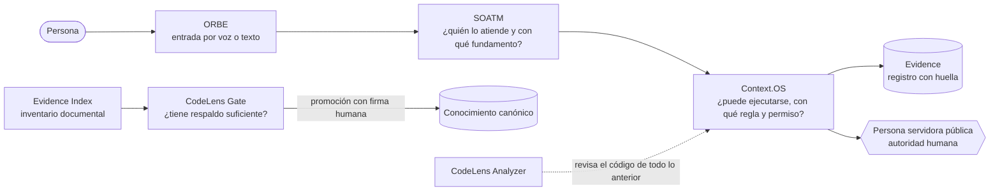

# Componentes de Gobernanza Digital: Context.OS, Evidence, CodeLens y SOATM

**Versión:** 1.0 · **Fecha:** 2026-10-03 · **Registro legible por máquina:** [`componentes.json`](./componentes.json)

Este documento explica, para una persona que no conoce el código, **para qué sirve cada componente, qué pregunta responde, cómo se usa y qué no hace**. Cada afirmación de madurez se respalda con pruebas que cualquiera puede ejecutar. La prueba `contextos/__tests__/componentes.test.ts` falla si este registro deja de coincidir con el código.

---

## 1. La idea en una frase

> Una persona expresa una necesidad; **SOATM** indica quién la atiende y con qué fundamento; **Context.OS** decide con reglas escritas si la acción procede; **Evidence** deja constancia verificable; **CodeLens Gate** impide que una afirmación sin respaldo se vuelva conocimiento oficial; y **CodeLens Analyzer** vigila la calidad del propio código.



**Principio común a todos:** ninguno ejecuta actos de autoridad. Recomiendan, deciden dentro de un laboratorio o dejan constancia; la autoridad final es siempre humana.

---

## 2. Tabla resumen

| Componente | Pregunta que responde | Madurez | Dónde vive | Cómo se prueba |
|---|---|---|---|---|
| **SOATM** | ¿Quién atiende esto y con qué fundamento legal? | Experimental | `next/modules/soatm/` | `npm run test:soatm` |
| **Context.OS** | ¿Esta acción puede ejecutarse, bajo qué regla y con qué permiso? | Experimental | `contextos/` | `npm run test:contextos` y `npm run test:orbe-p0-e2e` |
| **Evidence (registros)** | ¿Qué se decidió, cuándo, con qué regla, y el registro fue alterado? | Experimental | `contextos/evidence.ts` | `npm run test:contextos` |
| **Evidence Index** | ¿En qué documentos se apoya el sistema y cuáles cambiaron o están incompletos? | Experimental | `contextos/evidence-index/` | `npm run test:evidence-index` y `npm run evidencia:reporte` |
| **CodeLens Gate** | ¿Esta afirmación tiene respaldo suficiente para volverse conocimiento oficial? | Experimental | `contextos/codelens/` | `npm run test:codelens` |
| **CodeLens Analyzer** | ¿Qué código sobra, qué es complejo y qué falta probar? | Experimental | repositorio [`Autosociomx/codelens`](https://github.com/Autosociomx/codelens) | `pnpm test` en ese repositorio |

Todas las suites juntas: `npm run test:componentes`.

**Escala de madurez** (de menor a mayor): Propuesto → Experimental → Validado → Piloto → Producción → Institucional. *Experimental* significa: existe código con pruebas automáticas en verde, en laboratorio, sin integración con sistemas de gobierno reales y sin auditoría externa.

---

## 3. SOATM — Sistema Operativo de Atención de Trámites Mexicanos

**Para qué sirve.** Traduce una necesidad ciudadana ("hay una luminaria apagada", "quiero pagar el predial") a la dependencia responsable de cualquiera de los tres órdenes de gobierno y, en Tepic, a la unidad concreta, citando el artículo y la fracción que lo fundamentan.

**Cómo decide.** Consulta únicamente el registro verificado de `data/dependencias/` (238 instituciones, cada una con ley, artículo, fuente y fecha de consulta):

| Resultado | Cuándo | Qué hace el sistema |
|---|---|---|
| `FOUND` | El reglamento asigna la atribución de forma expresa, o el texto nombra una dependencia | Devuelve dependencia, unidad, fundamento y fuente |
| `AMBIGUOUS` | El nombre existe en más de un nivel (p. ej., Secretaría de Turismo federal y estatal) | Pide aclarar |
| `ATTRIBUTION_UNVERIFIED` | El servicio se conoce pero el reglamento no lo asigna (hoy: baches) | Escala a una persona; **no adivina** |
| `NOT_FOUND` | El registro no conoce la necesidad | Lo dice abiertamente |

**Uso:**
```ts
import { SoatmRoutingAgent } from './next/modules/soatm';
const r = await new SoatmRoutingAgent().handle(sobre); // sobre: AgentEnvelope con serviceQuery y jurisdiction
// r.data → { routeStatus: 'FOUND', institution, unit, legalBasis: { articulo, fraccion }, source }
```

**No hace:** no ejecuta trámites ni produce efectos jurídicos; no inventa una dependencia cuando la atribución no es expresa.

---

## 4. Context.OS — plano de control institucional

**Para qué sirve.** Es el "reglamento en código" que se interpone entre el asistente y cualquier acción: valida la solicitud, aplica una política determinística (sin inteligencia artificial), exige consentimiento cuando se comparten datos personales, resuelve el servicio en un catálogo explícito y ejecuta solo en adaptadores de laboratorio. Cada paso deja evidencia.

**Por qué importa.** Responde a la preocupación central sobre la IA en el gobierno: **un modelo de lenguaje nunca decide si algo procede**. Lo decide una regla escrita, versionada y probada.

**Flujo:** `Solicitud → Política → Consentimiento (si aplica) → Catálogo de servicios → Adaptador LAB_MOCK → Registro de evidencia`

**Uso:**
```ts
import { createLabContextOSRuntime } from './contextos';
const runtime = createLabContextOSRuntime();
const respuesta = await runtime.execute(solicitud); // EXECUTED | NEEDS_INPUT | NEEDS_CONSENT | DENIED | ERROR
```

**No hace:** no autoriza actos administrativos ni crea órdenes municipales reales; no integra Llave MX; no persiste el expediente ciudadano; sus adaptadores responden siempre `LAB_MOCK`.

---

## 5. Evidence — constancia verificable

"Evidence" agrupa **dos piezas distintas** que conviene no confundir:

### 5.1 Registros de evidencia del runtime (`contextos/evidence.ts`)
Cada decisión de Context.OS produce un registro con identificador, hora, regla aplicada, resultado y una **huella SHA-256** (un resumen matemático del contenido: si alguien cambia una sola letra, la huella deja de coincidir). Los datos personales de la solicitud **no** se guardan en el registro.

```ts
import { evidence } from './contextos';
evidence.verifyEvidenceRecord(registro); // true si nadie lo alteró
```

### 5.2 Evidence Index (`contextos/evidence-index/`)
Inventario de solo lectura de los documentos y contratos del repositorio: a cada uno le asigna un identificador estable, su huella, versión y fecha, y reporta cuáles están incompletos. Comparando dos índices se sabe **qué documento cambió** y, por tanto, qué decisiones que lo citaban deben revisarse.

```bash
npm run evidencia:reporte   # cobertura de metadatos de todo el marco documental
```

**Límite honesto de ambas piezas:** la huella detecta cambios, pero **no es firma digital, sello de tiempo ni prueba de inmutabilidad** frente a quien tenga acceso de escritura (`CHECKSUM_ONLY`). El siguiente incremento es un almacén de solo anexado con sellado de tiempo.

---

## 6. CodeLens — dos herramientas con el mismo apellido

Existen dos componentes llamados CodeLens. Hacen cosas distintas; de aquí en adelante se nombran siempre con su apellido completo.

### 6.1 CodeLens Gate (`contextos/codelens/`) — calidad del conocimiento
Antes de que una afirmación se vuelva "conocimiento oficial" del sistema, la compuerta revisa:

| Criterio | Qué verifica |
|---|---|
| Procedencia | ¿Cita evidencia que existe en el índice? |
| Reproducibilidad | ¿La fuente tiene huella y sigue coincidiendo? |
| Contradicción | ¿Choca con algo ya aceptado? (comparación léxica; siempre a revisión humana) |
| Datos personales | ¿Contiene CURP, RFC, correo, teléfono o CLABE? Si sí, se bloquea sin repetir el dato |
| Utilidad | ¿Es demasiado corta para evaluarse? |

Veredictos: `red` (rechazada), `yellow` (débil), `pending_review` (requiere persona) o `green`. **Toda promoción exige firma humana**; ningún modelo decide el veredicto.

### 6.2 CodeLens Analyzer (`@autosocio/codelens`, repositorio aparte) — calidad del código
Analiza un repositorio **sin ejecutarlo ni modificarlo** y aplica un algoritmo de cinco pasos: cuestionar requisitos, eliminar lo inalcanzable, simplificar lo complejo, acelerar lo que bloquea y automatizar lo que ya tiene pruebas. Aplicado a este repositorio el 2026-10-03 señaló 73 archivos sin ruta desde los puntos de entrada y 67 funciones exportadas sin prueba visible: insumos para la limpieza, que una persona debe confirmar.

```bash
# desde un clon de Autosociomx/codelens (el paquete aún no está publicado en npm)
pnpm install
pnpm analyze /ruta/a/Gobernanza-Digital --entry server.ts --entry src/main.tsx --json
```

---

## 7. Cómo se empaquetan

Cada componente cumple el mismo contrato de empaque:

1. **Un punto de entrada público** (`index.ts`). Quien lo usa importa de ahí, nunca de archivos internos.
2. **Una versión declarada** en una constante del código, igual a la de `componentes.json`.
3. **Un README** con qué es, qué hace, qué no hace y cómo se prueba.
4. **Un comando de prueba** propio en `package.json`.
5. **Límites explícitos** (`no_hace`) que viajan con el componente.

| Componente | Punto de entrada | Versión |
|---|---|---|
| Context.OS (incluye `evidence`, `evidenceIndex` y `codelens`) | `contextos/index.ts` | `contextos.v0.1` |
| Evidence Index | `contextos/evidence-index/index.ts` | `contextos.evidence-index.v0.1` |
| CodeLens Gate | `contextos/codelens/index.ts` | `contextos.codelens.gate.v0.1` |
| SOATM | `next/modules/soatm/index.ts` | `0.2.0` |
| CodeLens Analyzer | paquete `@autosocio/codelens` | `0.1.0` |

---

## 8. Glosario

- **Determinístico:** misma entrada, mismo resultado, siempre; sin azar ni modelo de IA.
- **LAB_MOCK:** modo de laboratorio; simula la respuesta de una institución sin tocar sistemas reales.
- **SHA-256 / huella:** resumen matemático de un contenido que cambia si el contenido cambia.
- **CHECKSUM_ONLY:** la integridad se respalda solo con huella, no con firma ni sello de tiempo.
- **Canónico:** la versión aceptada como oficial dentro del sistema.
- **Punto de entrada (`index.ts`):** el único archivo desde el que se importa un componente.
